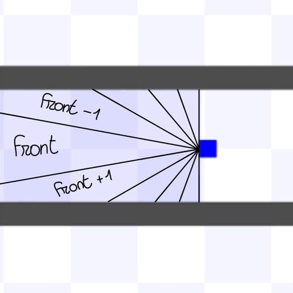
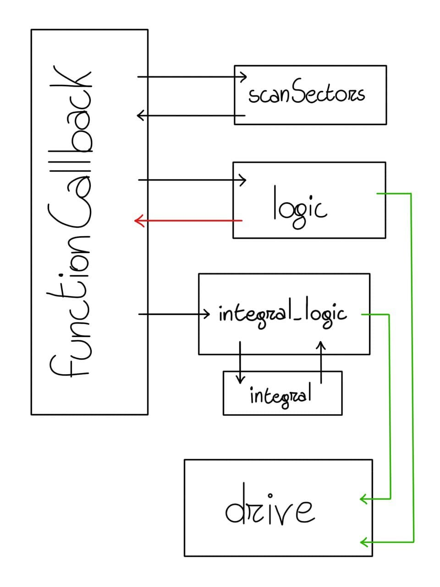
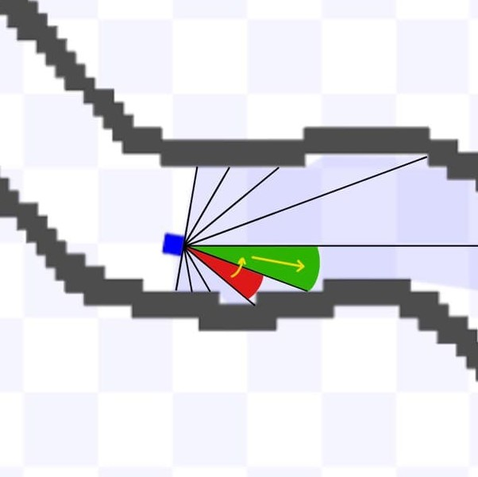
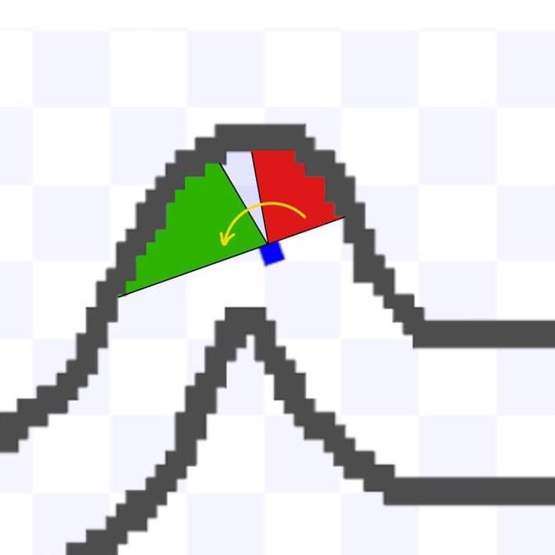
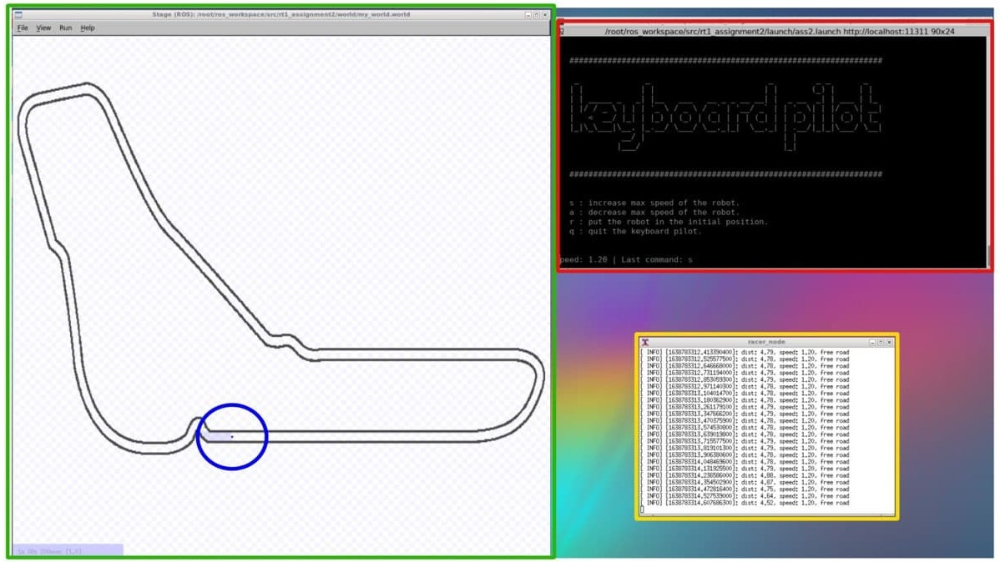

C++ Robotics simulator on ROS
=============================

>This ROS package aims to control a simple robot that runs along a circuit, equipped with a laser scanner, and with the possibility to increase or decrease its velocity.

Installing and running
----------------------

>Clone this repository in the `src` folder of your ROS workspace, compile it with `catkin_make` and run with:

```bash
$ roslaunch rt1_assignment2 ass2.launch
```

>For compiling and running, you need the `xterm` package; you can install it with:

```bash
$ sudo apt-get update
$ sudo apt-get install xterm
```

Assignment
----------

>The objective of the assignment is to make the robot ride in the circuit, avoiding boundaries and increasing or decreasing velocity as specified by the user.

>To achieve this goal, two ROS nodes were developed:
* `racer_node`
* `keyboard_pilot_node`

>The robot can divide the scanned space into sectors, finding the nearest obstacle in each one. The variable *nsect* specifies the number of sectors (default value = 9); changing this parameter can compromise the operation. The frontal sector is the one identified by the *front* value.

<p align="center">

</p>


### racer_node

>The racer_node aims to control the robot to follow the path without hurting the bound of the track, choosing to move further with a constant speed or to turn to avoid obstacles.
>The ROS node implementation and the logic of the robot is made on seven functions:
* `functionCallback`
* `scanSectors`
* `logic`
* `integral_logic`
* `integral`
* `drive`
* `server_response`

##### functionCallback

>This function is the callback for the base_scan subscriber; it is executed each time something is published on this specific topic.
>First, it calls the `scanSectors` function, then the function `logic` implements the choice made through sectors. If the function `logic` does not take any decision, then the `integral_logic` function is called.
>This flowchart represents the sequence of functions executed every time something is published on the base_scan topic:

<p align="center">

</p>

##### scanSectors

>The `scanSector` function is used to search for the closest obstacle in each sector. Its argument is the *ranges* vector provided by the laser scanner and the *sectors* vector. It fills *sectors* with the distance of the closest obstacle in this specific sector.

##### logic

>The `logic` function implements the logical part of the code, choosing whether to drive the robot forward or to make it turn to avoid obstacles. It's based on the information in the *sectors* vector, so previously filtered by the `scanSector` function. According to the choice made, it calls the `drive` function to move the robot. It returns 1 if it has made its choice, 1 otherwise.

<p align="center">

</p>

##### integral_logic

>The `integral_logic` function implements the second logical part of the code, and it's executed only when the first one can not make any choice. It can only turn the robot, and it does it based on the information included in the *ranges* vector. It computes the integral (calling the `integral` function) of the distance on the right-side and the left-side of the robot, obtaining the left and right area. Lastly, comparing these two values decides where to turn the robot; and calls the `drive` function to move it.

<p align="center">

</p>

##### integral

>This function computes a discrete integral with the trapezium method, returning the calculated area.

##### drive

>The `drive` function drives the robot, filling the geometry message and publishing it on the topic cmd_vel.

##### server_response

>This function is the callback for the command service. It increases or decreases the speed of the motor depending on the message received and replies with the updated velocity. It also updates the robot's distance break: which is proportional to its speed.

### keyboard_pilot_node

>The keyboard_pilot_node waits until a key is pressed by the user, then asks the racer_node with the `Command` service to perform the command received.
>The `getch` function is called to acquire a character from keyboard input, setting the attributes of the terminal to avoid pressing enter every time; and returning the character typed from the user.
>If the character is one of the available commands, it sends a request to the racer_node through the `command` server; if the command is the reset one, it also sends a request to the world node through the `reset_positions` service.


##### User Interface

>The interface of the keyboard_pilot_node started from the teleop_twist_keyboard (https://github.com/methylDragon/teleop_twist_keyboard_cpp.git "teleop_twist_keyboard_cpp"), it allows to refresh the same line printing each time the console receives an input.

### Global view

<p align="center">

</p>

-  world
-  keyboard_pilot
-  racer
-  robot

Possible improvements
---------------------

* Make the robot move more fluently.
* 
